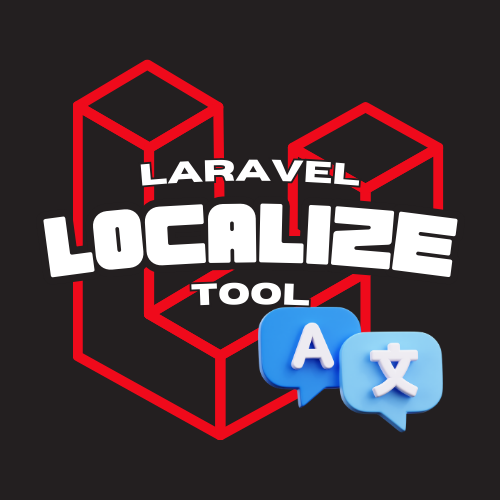

<h1 align="center">
   
  
   
    Laravel Localize Tool
   
</h1>

Easily Localize your Laravel project.

## Features

- Custom array key for each translation.
- Auto detect duplicated array keys.
- Auto detect current file type to replace selection with the proper directive/method.
- Auto detect invalid localize.php & auto re-create the file.

## Usage

## Settings

You may configure the following settings (`Settings` -> `Extensions` -> `Laravel Localize Tool`):

- `Target Path`: Relative Path to Lang Directory (ex: /resources/lang/ch/).
- `Target File Name`: Target PHP Translation file name. (Without .php extension).
- `Original Path`: Current text will be replaced with this Relative Path to Lang Directory (ex: /resources/lang/en/).

## Current Limitations & Future Work

- No support for nested array keys (ex: key1.key2).

## Release Notes

### 2.0.0

- Initial release.
